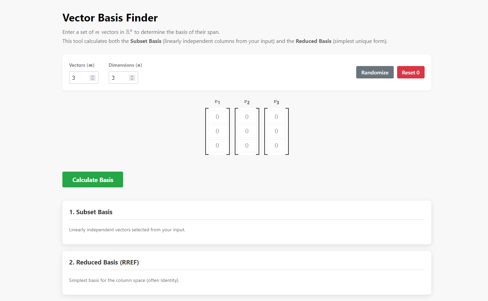

# Vector Basis Finder

A lightweight web application that finds the **basis of a vector span** in $\mathbb{R}^n$. Enter a set of vectors, and the app will compute and return a linearly independent subset that spans the same space — powered by **Python (Flask)** and **SymPy**.

> Built in partial fulfillment of the requirements for a Linear Algebra course.

---

## Live Demo

Try the app without any setup:
**[https://math206-vector-basis-finder.vercel.app/](https://math206-vector-basis-finder.vercel.app/)**

---

## Preview



---

## How to Use

1. Enter as many vectors as needed.
2. Enter the **dimension** of your vectors (e.g., `3` for vectors in $\mathbb{R}^3$).
3. Input each vector in the available fields.
4. Click **Calculate Basis** to compute the result.
5. The application will return a set of linearly independent vectors that form a basis for the span of your inputs.

---

## Setup & Installation

Follow these steps to run the application on your local machine.

### Prerequisites

- **Python 3.8+**
- **Git**

### Dependencies

| Dependency | Version | Purpose |
|---|---|---|
| Python | `>=3.8` | Core programming language
| Flask | `>=2.0` | Web server and routing |
| SymPy | `>=1.9` | Symbolic linear algebra computations |

> Exact versions are pinned in `requirements.txt`.

### 1. Clone the Repository

```bash
git clone https://github.com/5kappa/Vector-Basis-Finder.git
cd Vector-Basis-Finder
```

### 2. Create a Virtual Environment

**Windows:**
```bash
python -m venv venv
.\venv\Scripts\Activate
```

**Mac/Linux:**
```bash
python3 -m venv venv
source venv/bin/activate
```

### 3. Install Dependencies

```bash
pip install -r requirements.txt
```

### 4. Start the Application

```bash
python web_app.py
```

Then open your browser and navigate to **http://127.0.0.1:5000**.

---

## Contributing

Contributions, suggestions, and bug reports are welcome. To contribute:

1. Fork the repository.
2. Create a new branch: `git checkout -b feature/your-feature-name`
3. Commit your changes: `git commit -m 'Add some feature'`
4. Push to the branch: `git push origin feature/your-feature-name`
5. Open a Pull Request.

---

## License

This project is open source and available under the [MIT License](LICENSE).

---

## Contact

For questions or feedback, feel free to reach out via the repository's [Issues](https://github.com/5kappa/Vector-Basis-Finder/issues) page.

## Author's Note

This revised README was created as an assignment for a Technical Writing class.

The original README was accurate and concise, but (1) it never explained how to actually *use* the application once running, and (2) it lacked the standard sections (Contributing, License, Contact) expected of an open-source project. A **How to Use** section with a worked example was added to address both end-users and course evaluators, and a preview screenshot placeholder was included since the original had no visuals whatsoever. The dependencies table was added to surface version information that was previously hidden inside `requirements.txt`. Minor structural changes — standardizing dividers and merging the setup and run steps — were made to improve the document's overall consistency and flow.